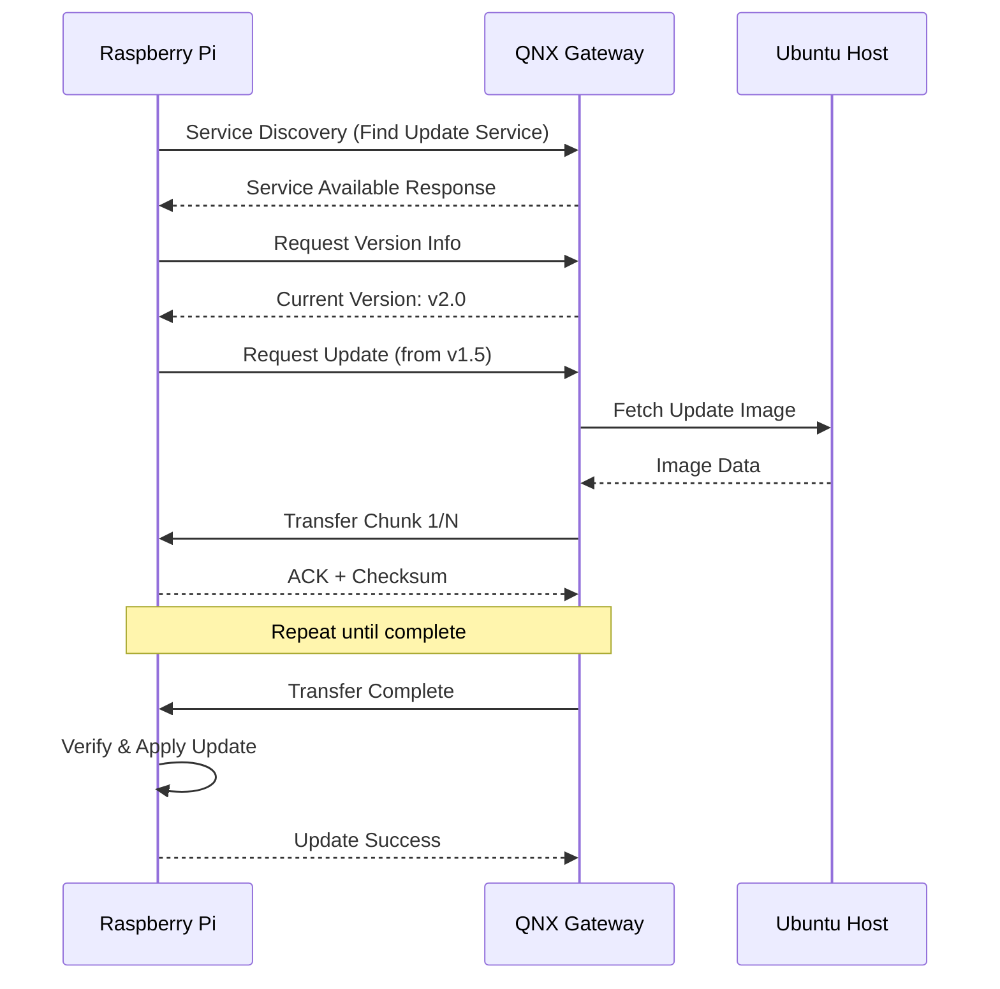

# QNX-Bridge-OTA

<div align="center">

**Enterprise-Grade Over-The-Air Update System for Heterogeneous Embedded Platforms**

[](https://opensource.org/licenses/MIT)
[](https://blackberry.qnx.com/)
[](https://covesa.github.io/capicxx-core-tools/)
[](https://www.yoctoproject.org/)

[Features](#-features) • [Architecture](#-architecture) • [Quick Start](#-quick-start) • [Documentation](#-documentation)

</div>

---

## 📋 Overview

**QNX-Bridge-OTA** is a production-ready Over-The-Air software update system demonstrating service-oriented architecture principles in heterogeneous embedded environments. The system leverages **CommonAPI over SOME/IP** to orchestrate secure, reliable firmware updates across multiple platforms.

### Platform Support

| Platform | Role | Purpose |
|----------|------|---------|
| **QNX RTOS** | OTA Gateway | Update orchestration, integrity validation, service discovery |
| **Raspberry Pi** | Update Target | Embedded Linux device receiving firmware updates |
| **Ubuntu Linux** | Development Host | Build system, testing, image preparation |
| **Qt6 GUI** | Monitoring Interface | Real-time status visualization (optional) |

---

## ✨ Features

### Core Capabilities
- 🔄 **Chunked File Transfer** - Efficient large file handling with resume support
- 🔐 **Integrity Validation** - Version comparison and checksum verification
- 🌐 **Service Discovery** - AUTOSAR SOME/IP-SD compliant discovery protocol
- 📦 **Update Management** - Metadata exchange and rollback support
- 🎯 **Cross-Platform** - QNX ↔ Linux interoperability

### Technical Highlights
- **Protocol**: CommonAPI with SOME/IP transport binding
- **Communication**: Request-response and publish-subscribe patterns
- **Interface Definition**: Franca IDL (`.fidl`)
- **Build System**: CMake with cross-compilation support
- **Yocto Integration**: Custom meta-layers for Raspberry Pi

---

## 🏗 Architecture

```
┌──────────────┐         SOME/IP          ┌──────────────┐
│              │◄──────────────────────────►│              │
│  QNX Gateway │  Service Discovery (SD)   │  RPi Target  │
│   (Server)   │  Request/Response/Events  │   (Client)   │
│              │                            │              │
└──────┬───────┘                            └──────────────┘
       │
       │ CommonAPI Interface
       │
┌──────▼───────┐
│   Qt6 GUI    │
│  Monitoring  │
└──────────────┘
```

### Component Interaction



---

## 🚀 Quick Start

### Prerequisites

```bash
# Install dependencies (Ubuntu)
sudo apt update
sudo apt install -y cmake build-essential libboost-all-dev

# Clone repository
git clone https://github.com/Mo-Alsehli/QNX-Bridge-OTA.git
cd QNX-Bridge-OTA
```

### Build & Run

#### 1. Ubuntu Development Setup
```bash
cd CommonAPI-FileTF-ubuntu
mkdir -p build && cd build
cmake ..
make -j$(nproc)

# Run server
./FileTransferServer &

# Run client
./FileTransferClient
```

#### 2. QNX Gateway Deployment
```bash
cd CommonAPI-QNX-OTA
mkdir -p build && cd build
cmake -DCMAKE_TOOLCHAIN_FILE=../../CommonAPI-Patchs/toolchain-qnx.cmake ..
make

# Transfer to QNX VM and run
scp FileTransferServer qnx-vm:/tmp/
ssh qnx-vm "/tmp/FileTransferServer"
```

#### 3. Raspberry Pi Target (Yocto)
```bash
# Build custom Yocto image with OTA support
cd yocto-meta-layers/meta-ota
bitbake core-image-ota

# Flash to SD card
dd if=tmp/deploy/images/raspberrypi3-64/core-image-ota.wic of=/dev/sdX bs=4M
```

---

## 📂 Repository Structure

```
QNX-Bridge-OTA/
├── CommonAPI-QNX-OTA/           # 🎯 Primary OTA Implementation
│   ├── src/                     # Client & Server logic
│   ├── fidl/                    # Franca IDL definitions
│   ├── src-gen/                 # Generated CommonAPI code
│   └── vsomeip.json             # SOME/IP configuration
│
├── QNX-Ota-Server/              # Minimal QNX server for testing
├── CommonAPI-FileTF-ubuntu/     # Ubuntu build for rapid iteration
├── vsomeip_rpi_ubuntu/          # RPi SOME/IP validation
│
├── GUI/                         # 🖥 Qt6 Monitoring Interface
│   ├── cards/                   # State-based UI cards
│   ├── components/              # Reusable UI components
│   └── backend/                 # CommonAPI integration
│
├── docs/                        # 📚 Comprehensive Documentation
│   ├── CommonAPI/               # Installation & usage guides
│   ├── SOME-IP/                 # Protocol specifications
│   ├── Service-Discovery/       # AUTOSAR SD documentation
│   └── system-architecture/     # Diagrams & requirements
│
├── yocto-meta-layers/           # 🔧 Custom Yocto Layers
│   ├── meta-ota/                # OTA recipes & services
│   ├── meta-gpio-led/           # Hardware drivers
│   └── meta-mmagdi-distro/      # Custom distribution
│
└── CommonAPI-Patchs/            # QNX compatibility patches
```

---

## 📖 Documentation

Detailed technical documentation is available in the [`docs/`](docs/) directory:

| Category | Contents |
|----------|----------|
| **CommonAPI** | Installation guides, code generation, Ubuntu & QNX setup |
| **SOME/IP** | Protocol overview, message formats, transport bindings |
| **Service Discovery** | AUTOSAR SD concepts, message types, discovery flow |
| **Architecture** | Component diagrams, deployment diagrams, sequence flows |
| **System Requirements** | Functional requirements, architectural constraints |

### Key Documents
- [CommonAPI Installation (Ubuntu)](docs/CommonAPI/03_commonapi-install-ubuntu.md)
- [CommonAPI Installation (QNX)](docs/CommonAPI/05_commonapi-core-runtime-install-qnx.md)
- [SOME/IP Protocol Guide](docs/SOME-IP/SOME-IP-FullGuide.md)
- [System Requirements](docs/System-Requirements/system_requirements.md)

---

## 🛠 Technology Stack

<table>
<tr>
<td>

**Middleware**
- CommonAPI Core Runtime
- CommonAPI SOME/IP Runtime
- vsomeip (SOME/IP implementation)

</td>
<td>

**Platforms**
- QNX 7.1 RTOS
- Yocto Project (Kirkstone)
- Ubuntu 22.04 LTS

</td>
</tr>
<tr>
<td>

**Build Tools**
- CMake 3.28+
- GCC/G++ 11+
- QNX SDP 7.1 Toolchain

</td>
<td>

**Languages**
- C++17
- Franca IDL
- QML (Qt6)

</td>
</tr>
</table>

---

## 🎓 Learning Objectives

This project demonstrates:

✅ **Service-Oriented Architecture** in embedded systems  
✅ **Inter-Process Communication** using SOME/IP  
✅ **Cross-Platform Development** (RTOS ↔ Linux)  
✅ **OTA Update Patterns** with rollback support  
✅ **Build System Integration** (CMake, Yocto)  
✅ **Protocol Compliance** (AUTOSAR standards)

---

## 📊 System Workflow

1. **Service Discovery**: Raspberry Pi discovers QNX OTA service via SOME/IP-SD
2. **Version Check**: Client requests current firmware version from gateway
3. **Update Request**: If newer version available, client initiates download
4. **Chunked Transfer**: QNX gateway streams update image in verified chunks
5. **Integrity Validation**: Each chunk validated with checksums
6. **Installation**: Client applies update with atomic rollback capability
7. **Verification**: Post-update health check and version confirmation

---

## 🤝 Contributing

Contributions are welcome! This project is designed for educational and research purposes.

### Development Workflow
1. Fork the repository
2. Create a feature branch (`git checkout -b feature/improvement`)
3. Commit changes (`git commit -am 'Add new feature'`)
4. Push to branch (`git push origin feature/improvement`)
5. Open a Pull Request

---

## 📄 License

This project is licensed under the MIT License - see the [LICENSE](LICENSE) file for details.

---

## 🔗 References

- [AUTOSAR SOME/IP Specification](https://www.autosar.org/)
- [CommonAPI Documentation](https://covesa.github.io/capicxx-core-tools/)
- [QNX Software Development Platform](https://blackberry.qnx.com/)
- [Yocto Project](https://www.yoctoproject.org/)

---

<div align="center">

**Built with ❤️ for the embedded systems community**

[⬆ Back to Top](#qnx-bridge-ota)

</div>