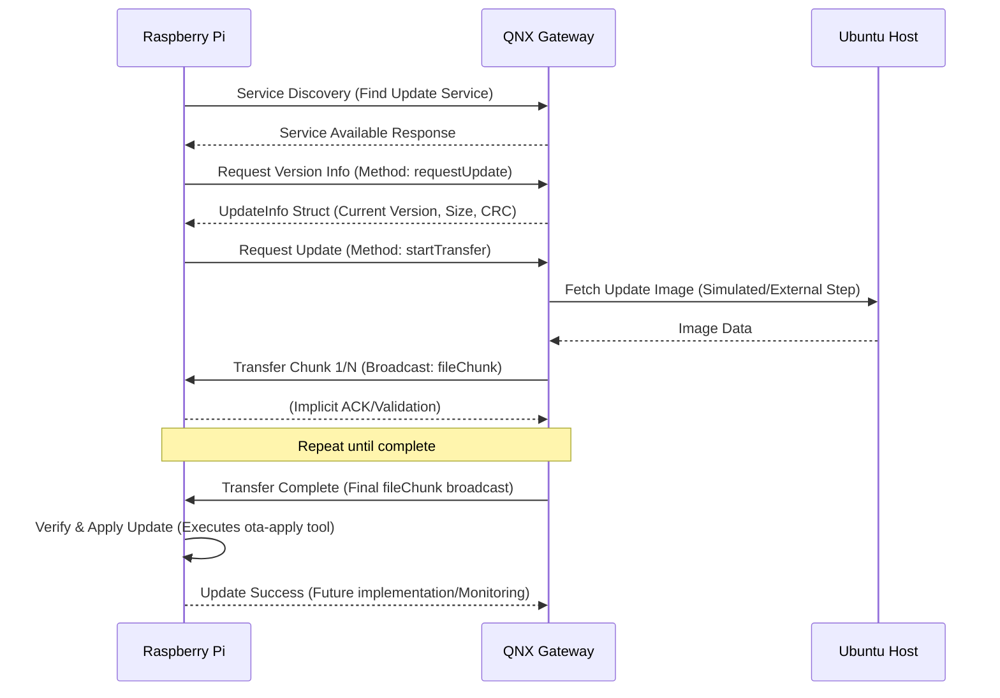

# QNX-Bridge-OTA

<div align="center">

**Enterprise-Grade Over-The-Air Update System for Heterogeneous Embedded Platforms**


[](https://opensource.org/licenses/MIT)
[](https://blackberry.qnx.com/)
[](https://covesa.github.io/capicxx-core-tools/)
[](https://www.yoctoproject.org/)

[Features](#-features) • [Architecture](#-architecture) • [Development-History](#-development-history) • [Project-Evaluation](#-project-evaluation) • [Documentation](#-documentation)

</div>

---

## 📋 Overview

**QNX-Bridge-OTA** is a production-ready Over-The-Air software update system demonstrating service-oriented architecture principles in heterogeneous embedded environments. The system leverages **CommonAPI over SOME/IP** to orchestrate secure, reliable firmware updates across multiple platforms. The QNX RTOS acts as a **bridge/gateway**, hosting the OTA service, while the Raspberry Pi serves as the **target device** that securely receives and applies the updates using a robust A/B partitioning scheme.

### Platform Support

| Platform | Role | Purpose |
| :--- | :--- | :--- |
| **QNX RTOS** | OTA Gateway | Update orchestration, integrity validation, service discovery, and hosting the `FileTransferServer`. |
| **Raspberry Pi** | Update Target | Embedded Linux device running the `FileTransferClient` and the **A/B update tool** for atomic firmware updates. |
| **Ubuntu Linux** | Development Host | Build system, testing, and image preparation for both QNX and RPi targets. |
| **Qt6 GUI** | Monitoring Interface | Real-time status visualization, integrated with the CommonAPI client backend. |

---

## ✨ Features

### Core Capabilities
- 🔄 **Chunked File Transfer** - Efficient large file handling with resume support, implemented via a CommonAPI broadcast event (`fileChunk`).
- 🔐 **Integrity Validation** - Version comparison and **CRC32 checksum** verification for data integrity.
- 🌐 **Service Discovery** - **AUTOSAR SOME/IP-SD** compliant discovery protocol for dynamic service location.
- 📦 **Update Management** - Metadata exchange (`UpdateInfo` struct) and support for **atomic A/B updates** with rollback capability.
- 🎯 **Cross-Platform** - Seamless QNX ↔ Linux interoperability using standardized middleware.

### Technical Highlights
- **Protocol**: CommonAPI with SOME/IP transport binding, ensuring high-performance, low-latency communication.
- **Communication**: Request-response (`requestUpdate`, `startTransfer`) and publish-subscribe (`fileChunk` broadcast) patterns.
- **Interface Definition**: **Franca IDL** (`.fidl`) is used to define the service interface, enabling automatic code generation for C++ stubs and proxies.
- **Build System**: **CMake** with advanced cross-compilation support, specifically utilizing a custom `toolchain-qnx.cmake` file.
- **Yocto Integration**: Custom meta-layers (`meta-ota`, `meta-gpio-led`, `meta-mmagdi-distro`) are used to create a minimal, reproducible, and customized Linux image for the Raspberry Pi.

---

## 🏗 Architecture

```
┌──────────────┐         SOME/IP            ┌──────────────┐
│              │◄──────────────────────────►│              │
│  QNX Gateway │  Service Discovery (SD)    │  RPi Target  │
│   (Server)   │  Request/Response/Events   │   (Client)   │
│              │                            │              │
└──────────────┘                            └───────┬──────┘
                                                    │
                                                    │ CommonAPI Interface
                                                    │
                                             ┌──────▼───────┐
                                             │   Qt6 GUI    │
                                             │  Monitoring  │
                                             └──────────────┘
```

### Component Interaction

The core OTA logic is encapsulated in the `FileTransfer` service, defined in Franca IDL, which facilitates the following sequence:



### A/B Update Mechanism

The Raspberry Pi client utilizes a dedicated C++ tool, **`ota-apply`**, to manage the A/B update process:
1.  **Slot Detection:** Reads `/proc/cmdline` to determine the currently active boot slot (A or B).
2.  **Target Selection:** Selects the inactive slot as the target for the new image.
3.  **Image Write:** Streams the received update image (e.g., `rootfs.ext4`) directly to the inactive partition device (`/dev/mmcblk0pX`).
4.  **Bootloader Update:** Atomically modifies the **`extlinux.conf`** file to set the newly updated partition as the active boot slot for the next reboot.
This mechanism ensures that a failed update does not brick the device, as the system can always fall back to the last known good partition.

---

## ⏳ Development History

The project was built incrementally, moving from basic protocol validation to the final, complex application. This history is reflected in the various test applications and patches within the repository.

| Step | Description | Repository Component(s) |
| :--- | :--- | :--- |
| **1 & 2** | Yocto setup and QNX OS familiarization. | `yocto-meta-layers` |
| **3** | Installed and built `vsomeip` for RPi, Ubuntu, and QNX. Tested basic SOME/IP communication. | `Apps/vsomeip_rpi_ubuntu`, `QNX-CommonAPI-Lib-Patchs` (for QNX build) |
| **4 & 5** | Installed and built CommonAPI for Ubuntu/RPi. Manually batched and patched CommonAPI for QNX compatibility. | `QNX-CommonAPI-Lib-Patchs` |
| **6** | Created test applications to validate CommonAPI communication across all three platforms. | `Apps/HelloCommonAPI-ubuntu`, `Apps/commonapi-server-qnx` |
| **7** | Completed the final backend application logic (client/server) for the OTA file transfer. | `CommonAPI-QNX-OTA`, `QNX-Ota-Server` |
| **8 & 9** | Developed the Qt6 GUI and integrated it with the CommonAPI client application. | `GUI` submodule |
| **10** | Developed the `ota-apply` tool for applying the update using A/B logic. | `ota-update-tool` |

---

## ✅ Project Evaluation

The project structure is **highly professional** and demonstrates a strong understanding of best practices for complex, embedded, and service-oriented projects.

| Aspect | Evaluation | Rationale |
| :--- | :--- | :--- |
| **Modularity** | **Excellent.** | Clear separation of concerns: core logic (`CommonAPI-QNX-OTA`), testing apps (`Apps`), build system (`yocto-meta-layers`), and UI (`GUI`) are in distinct, version-controlled units (submodules). |
| **Build System** | **Excellent.** | The use of **Yocto** is the industry standard for creating reproducible, minimal, and maintainable Linux distributions for embedded targets. |
| **Cross-Platform Support** | **Excellent.** | The dedicated patch directory (`QNX-CommonAPI-Lib-Patchs`) to handle the complexities of cross-compiling middleware for QNX is a professional and necessary approach for RTOS integration. |
| **Update Mechanism** | **Excellent.** | The custom `ota-apply` tool, which implements a robust A/B update strategy by manipulating the bootloader configuration (`extlinux.conf`), is a resilient solution for mission-critical embedded updates. |

---

## 📂 Repository Structure

```
QNX-Bridge-OTA/
├── CommonAPI-QNX-OTA/           # 🎯 Core OTA Client/Server Logic (FileTransfer Service)
│   ├── src/                     # Client & Server logic (RPi client, QNX server)
│   ├── fidl/                    # Franca IDL definitions for FileTransfer service
│   ├── src-gen/                 # Generated CommonAPI code (proxies/stubs)
│   └── vsomeip.json             # SOME/IP configuration for the service
│
├── QNX-Ota-Server/              # Minimal QNX server for testing the service
├── ota-update-tool/             # **A/B Update Tool** (`ota-apply` C++ source)
├── GUI/                         # 🖥 Qt6 Monitoring Interface (Git Submodule)
├── QNX-CommonAPI-Lib-Patchs/    # QNX compatibility patches for CommonAPI/vsomeip libraries
├── yocto-meta-layers/           # 🔧 Custom Yocto Layers (Git Submodule)
│   ├── meta-ota/                # OTA recipes, services, and build logic
│   └── ...                      # Other custom layers (e.g., meta-gpio-led)
│
├── Apps/                        # Testing and Validation Applications (e.g., HelloCommonAPI)
├── docs/                        # 📚 Comprehensive Documentation (Protocols, Architecture, Setup)
└── ...
```

---

## 📖 Documentation

Detailed technical documentation is available in the [`docs/`](docs/) directory:

| Category | Contents |
| :--- | :--- |
| **CommonAPI** | Installation guides, code generation, Ubuntu & QNX setup |
| **SOME/IP** | Protocol overview, message formats, transport bindings |
| **Service Discovery** | AUTOSAR SD concepts, message types, discovery flow |
| **Architecture** | Component diagrams, deployment diagrams, sequence flows |
| **System Requirements** | Functional requirements, architectural constraints |

### Key Documents
- [CommonAPI Installation (Ubuntu)](docs/CommonAPI/03_commonapi-install-ubuntu.md)
- [CommonAPI Installation (QNX)](docs/CommonAPI/05_commonapi-core-runtime-install-qnx.md)
- [SOME/IP Protocol Guide](docs/SOME-IP/SOME-IP-FullGuide.md)
- [System Requirements](docs/System-Requirements/system_requirements.md)

---

## 🛠 Technology Stack

| Category | Technology | Version/Detail |
| :--- | :--- | :--- |
| **Gateway OS** | QNX RTOS | QNX Software Development Platform (SDP) 8.0 |
| **Client OS** | Embedded Linux | Yocto Project (Kirkstone) built for Raspberry Pi |
| **Middleware** | SOME/IP | `vsomeip` implementation |
| **Middleware** | Service Layer | CommonAPI Core Runtime & CommonAPI SOME/IP Runtime |
| **Languages** | Core Logic | C++17 |
| **Languages** | Interface Definition | Franca IDL |
| **Languages** | GUI | QML (Qt6) |
| **Build Tools** | Cross-Compilation | CMake 3.28+ with QNX SDP 8.0 Toolchain |
| **Update Tool** | Mechanism | Custom A/B partition writer (`ota-apply`) |

---

## 📊 System Workflow

1. **Service Discovery**: Raspberry Pi discovers QNX OTA service via SOME/IP-SD.
2. **Version Check**: Client requests current firmware version from gateway using the `requestUpdate` method.
3. **Update Request**: If a newer version is available, the client initiates the download via `startTransfer`.
4. **Chunked Transfer**: QNX gateway streams the update image in verified **64KB chunks** using the `fileChunk` broadcast event.
5. **Integrity Validation**: Each chunk is validated, and the final image is checked against the **CRC32** provided in the `UpdateInfo`.
6. **Installation**: The client executes the **`ota-apply`** tool to write the image to the inactive A/B partition and update the bootloader.
7. **Verification**: Post-update health check and version confirmation on the next reboot.

---

## 🔗 References

- [1] [vsomeip in 10 minutes](https://github.com/COVESA/vsomeip/wiki/vsomeip-in-10-minutes)
- [2] [CommonAPI Documentation](https://github.com/COVESA/capicxx-core-tools/wiki)
- [3] [QNX Software Development Platform](https://www.qnx.com/developers/docs/8.0/com.qnx.doc.qnxsdp.nav/topic/bookset.html)
- [4] [Yocto Project](https://www.yoctoproject.org/)
- [5] [QNX-Raspberry Pi Integration Overview (Video)](https://youtu.be/s8_rvkSfj10?si=fwmeZ1JSDAjHB9g6)

---

<div align="center">

**Built with ❤️ for the embedded systems community**

[⬆ Back to Top](#qnx-bridge-ota)

</div>
