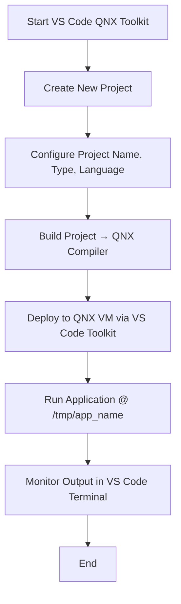

# QNX Applications

> This guide provides a complete walkthrough for **creating, compiling, and deploying QNX projects using the VS Code QNX Toolkit**, targeting a running QNX OS instance on VMware.

---

## 1. Overview

QNX applications can be built and managed directly through the **QNX Extension Toolkit** in Visual Studio Code.
This workflow simplifies development by integrating the build, deploy, and run processes into one environment — eliminating the need to manually transfer binaries to your QNX VM.

---

## 2. Creating a New QNX Project in VS Code Toolkit

### **Step 1: Launch the Toolkit**

* Open VS Code and ensure the **QNX Extension Toolkit** is installed and active.
* From the **QNX COMMANDS** tab (available in the Command Palette or side menu), select:
  `Projects → Create New Project...`

---

### **Step 2: Configure the Project**

During project creation, configure the following:

| Configuration Field   | Description                                                                                 |
| --------------------- | ------------------------------------------------------------------------------------------- |
| **Project Name**      | Choose a descriptive name for your project.                                                 |
| **Project Type**      | Select **QNX Recursive Makefile** — allows multi-architecture support (`x86`, `ARM`, etc.). |
| **Language**          | Choose **C** or **C++** depending on your project requirements.                             |
| **Build Output Type** | Choose between **Executable** or **Shared Library (.so)**.                                  |

> **Note:**
> The **recursive makefile** structure is ideal for large or multi-target projects, enabling one project tree to compile for multiple hardware architectures.

---

### **Step 3: Finalize Creation**

Once the configuration is done:

* Click **Finish / Create**.
* The project structure will be generated with default source and makefile templates.

---

## 3. Building (Compiling) Your Program

**Steps to Compile:**

1. Right-click on your project name in the **Explorer Panel**.
2. Choose:
   `QNX → Build Active Project`
3. The build system will automatically use the proper QNX cross-compiler toolchain (defined in your QNX SDP environment).
4. The build output appears in the **Terminal / Output panel**.

> ✅ A successful build generates your compiled binary (e.g., `myapp`) inside the project’s output directory.

---

## 4. Deploying and Running the Application

To deploy your application on a **running QNX Virtual Machine**:

### **Step 1: Ensure VM is Running**

* Start your QNX OS virtual machine on **VMware**.
* Ensure it is network-accessible (typically via NAT or bridged adapter).
* If you haven’t yet installed QNX OS on VMware, see:
  [`OS-installation-guide-VM.md`](./OS-installation-guide-VM.md)

---

### **Step 2: Deploy the Application**

1. In VS Code, **right-click** the project name.
2. Select:
   `QNX → Run as QNX Application`.
3. The toolkit will automatically:

   * Transfer your binary to the running QNX OS.
   * Execute it remotely.
   * Display logs/output directly in VS Code.

---

### **Step 3: Locate Deployed Binary**

* By default, deployed binaries are stored in your QNX system under:

  ```
  /tmp/app_name
  ```
* You can re-run it manually from your QNX shell:

  ```bash
  /tmp/app_name &
  ```

---

## 5. Summary of Workflow

| Phase               | Action                                     | Tool / Command                      |
| ------------------- | ------------------------------------------ | ----------------------------------- |
| **Project Setup**   | Create new project                         | `QNX Commands → Create New Project` |
| **Configuration**   | Define language, architecture, output type | VS Code dialog                      |
| **Build**           | Compile source code                        | `QNX → Build Active Project`        |
| **Deploy**          | Run on QNX VM                              | `QNX → Run as QNX Application`      |
| **Binary Location** | Verify output                              | `/tmp/app_name`                     |

---

## 6. Key Notes & Tips

* Always ensure your **QNX SDP environment** and **license** are properly configured before building.
* Use **recursive makefiles** for modular and scalable codebases.
* For debugging or log tracing, use the **QNX Target Console** or **VS Code Terminal** after deployment.
* Keep your QNX VM snapshots to avoid environment corruption during builds.

---

## 7. Visual Summary (Development Flow)



---

## 8. Reference

* QNX Documentation: [https://www.qnx.com/developers/](https://www.qnx.com/developers/)
* Related Guide: `OS-installation-guide-VM.md`
* QNX Youtube: [video](https://www.youtube.com/watch?v=M02X6AqdK7M&t=185s)
